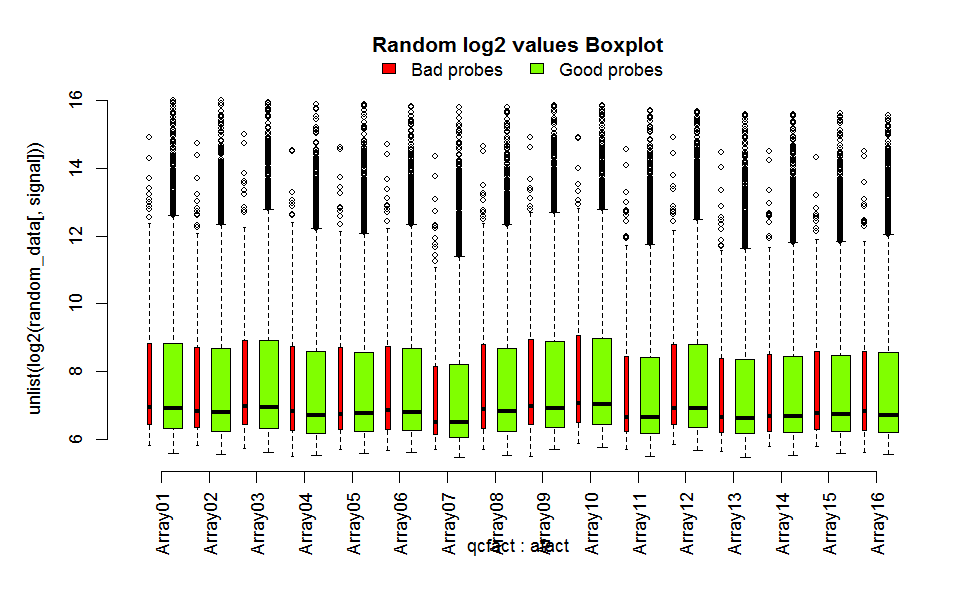
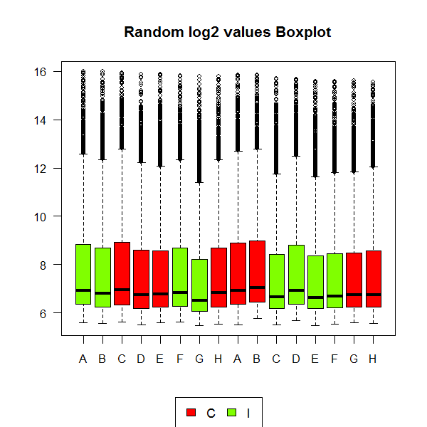
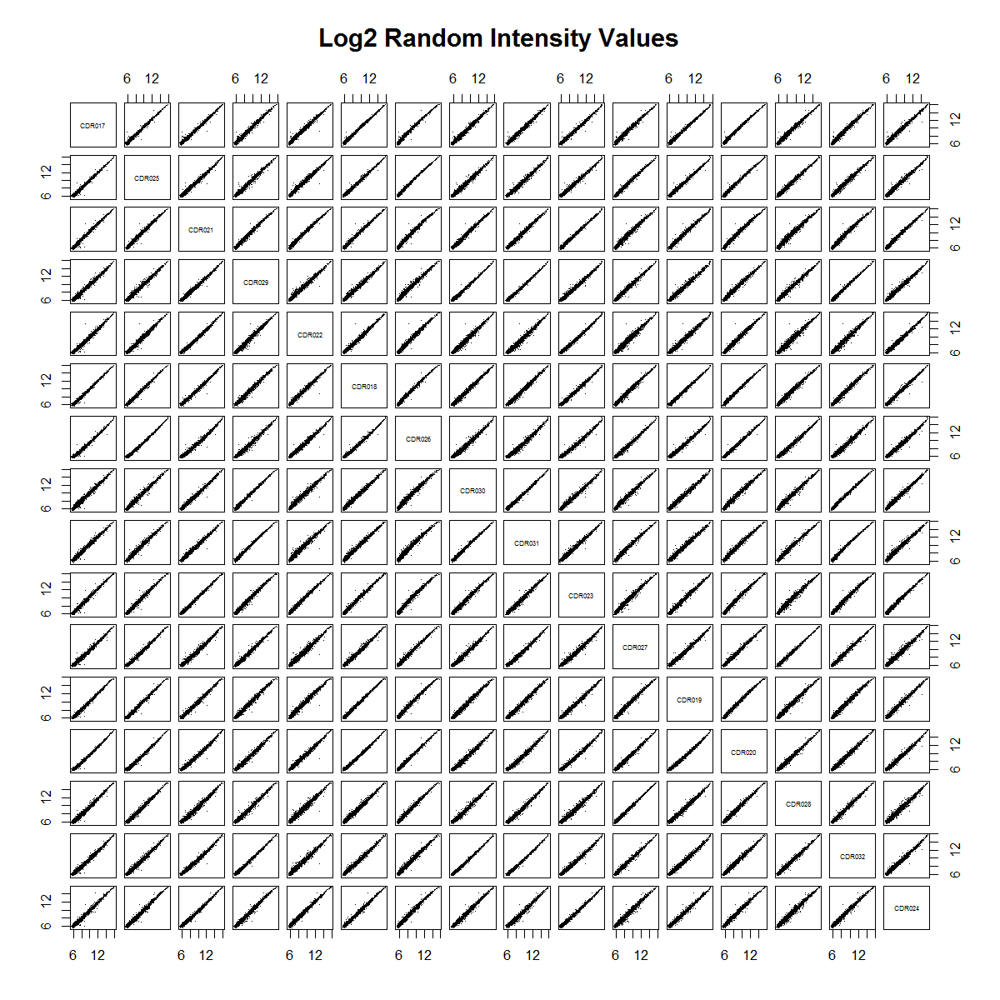
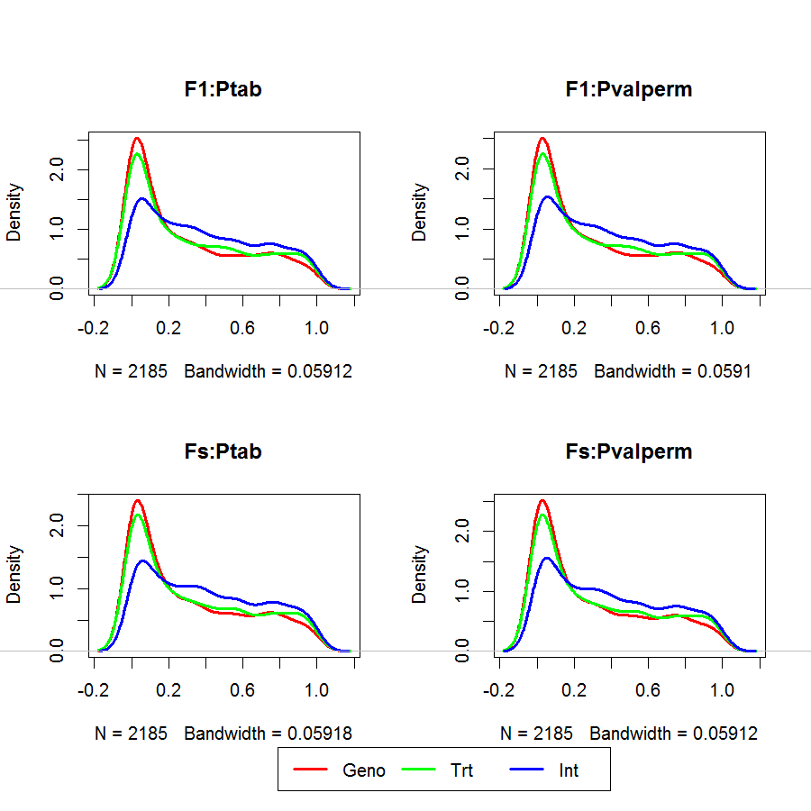
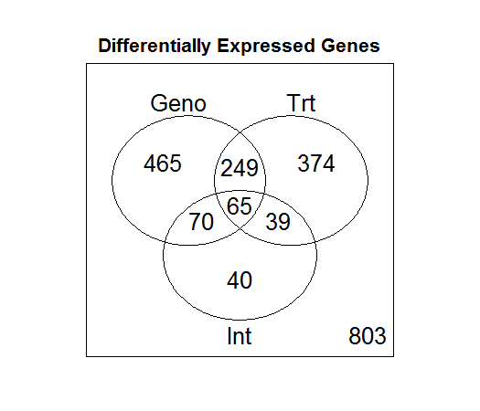
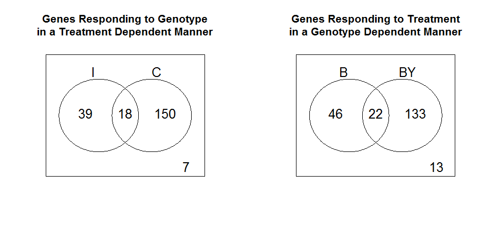

## Universidad Nacional Autónoma de México, Comisión Nacional para el Conocimiento y Uso de la Biodiversidad, Universidad de Chile
## Curso intensivo: Introducción a la bioinformática e investigación reproducible para análisis genómicos

### Unidad 7: Análisis de transcriptomas
### Práctica 7.1 Análisis de expresión diferencial con microarreglos en R
### Nombre de la estudiante: Raquel Hernández Austria

### Introducción
El análisis de la expresión de genes mediante la detección de transcriptos específicos, realizado baja una determinada condición experimental, es una de las estrategias más exitosas dentro del campo de la genómica funcional. El conjunto de genes expresados o transcriptos a partir del DNA genómico (transcriptoma) es un determinante fundamental de la función y fenotipo celular. La transcripción es el primer paso hacia la síntesis de proteínas y, por lo tanto, es altamente indicativa de la respuesta celular a los estímulos ambientales o externos. Entender la función de los genes, la dinámica del transcriptoma y el conocimiento del perfil de genes expresados proporcionan una visión sobre los posibles mecanismos regulatorios o bioquímicos, permiten evaluar la posible causa y la consecuencia de las enfermedades, y permiten identificar genes para una intervención farmacológica putativa (Rabinovich, 2004). 
La expresión diferencial es el cambio de los niveles de expresión de uno o más genes entre dos o varios condiciones.

### Objetivos
Evaluar el efecto de la variación genética en el cromosoma Y del ratón sobre el tamaño de los cardiomiocitos y la posible dependencia de tales efectos en niveles de testosterona, utilizando datos de perfiles de expresión génica en el tejido cardíaco de ratones. Particularmente, 1) determinar si existe expresión diferencial entre genotipos, 2) determinar si existe expresión diferencial entre tratamientos, y 3) evaluar las diferencias en la respuesta al tratamiento entre los dos genotipos, es decir, si existe una interacción entre los dos genotipos.

### Materiales y métodos

* Diseño experimental:
Se ensayaron ocho ratones machos adultos de dos cepas, C57BL/6J y C57BL/6J-chrY<A/J/NaJ>, denominadas B y BY, respectivamente. De cada cepa (genotipo), cuatro animales fueron castrados y cuatro fueron intervenidos con el mismo procedimiento quirúrjuico, excepto que no se realizó la castración (animales intactos usados como control). El ARN se hibridizó a BeadChips Illumina MouseRef-8 v2.0 que contienen ocho microarreglos con 25,697 sondas cada uno. Solo se seleccionaron aleatoriamente 5,000 sondas para este tutorial (ver cómo se realizó más abajo). Para saber más sobre el diseño experimental consultar a Verdugo et al., 2009. 

* Análisis bioinformático:
Para realizar el análisis de los datos se descargaron el conjunto de datos completo disponible en la base de datos GEO por ID GSE15354 en http://www.ncbi.nlm.nih.gov/geo/query/acc.cgi?acc=GSE15354. 
Los scripts y datos necesarios para ejecutar este tutorial se encuentran disponibles en DE_tutorial del servidor genoma.med.uchile.cl de la Universidad de Chile, por lo que fue necesario descargarlos a una computadora personal. 
Los datos se analizaron en el programa RStudio utilizando los comandos que se muestran a continuación:

#### 1. Acciones preliminares
* Descargar e instalar paqueterías disponibles en Bioconductor (http://www.bioconductor.org):
```R
library(org.Mm.eg.db)
library(preprocessCore)
library(maanova)
library(limma)
library(topGO)
```

* Definir algunas constantes
```R
outdir     <- "output"
fdr_th     <- 0.19 # Proporción de descubrimientos falsos que son aceptables 
```

* Leer un archivo que define algunas funciones que son necesarias para el análisis.
```R
source("Rfxs.R")
```

* Crear un directorio de salida
```R
if(!file.exists(outdir)) {
  dir.create(outdir, mode = "0755", recursive=T)
}
```
#### 2. Lectura de sondas y aleatorización de datos

* Cargar los datos crudos de las sondas y extraer aleatoriamente 5,000 filas. Leer los valores de la expresión del gen, se encuentran en la columna *CDR*. La columna *Detection.Pval* contiene valores *p* para la detección de transcritos, que se utilizarán para determinar si un gen se expresa.
```R
Data.Raw <- read.delim("C:/BIOINFORMATICA/DE_turotial2/GSE15354_raw.txt", header=TRUE)
random_data <- Data.Raw[sample(nrow(Data.Raw), 5000), ]
signal    <- grep("CDR", colnames(random_data)) # vector de columnas con datos 
detection <- grep("Detection.Pval", colnames(random_data)) # vector de columnas con valores p
```
* Importar las anotaciones de las sondas, y extraer las 5,000 anotaciones correspondientes a las 5,00 datos extraídos en el paso anterior.
```R
annot     <- read.delim("C:/BIOINFORMATICA/DE_turotial2/MouseRef-8_annot_full.txt")
random_names <- rownames(random_data)
annot = annot[row.names(annot)%in%random_names,]
```
* Anotar la calidad de las sondas al ser alineadas contra el genoma de referencia.
```R
table(annot$ProbeQuality)
 ```

* Leer la tabla con el diseño de las hibridaciones. 
```R
 design <- read.csv("../data/YChrom_design.csv") ## El archivo .csv se encuentra en el directrorio DE_tutorial
 print(design)
Array Sample_Name Sentrix_ID Sentrix_Position Genotype Treatment Group
1      1  CDR017-DIL 4340571022                A        B         I   B.I
2      2      CDR025 4340571022                B       BY         I  BY.I
3      3      CDR021 4340571022                C        B         C   B.C
4      4  CDR029-DIL 4340571022                D       BY         C  BY.C
5      5      CDR022 4340571022                E        B         C   B.C
6      6      CDR018 4340571022                F        B         I   B.I
7      7  CDR026-DIL 4340571022                G       BY         I  BY.I
8      8  CDR030-DIL 4340571022                H       BY         C  BY.C
9      9  CDR031-DIL 4340571033                A       BY         C  BY.C
10    10      CDR023 4340571033                B        B         C   B.C
11    11  CDR027-DIL 4340571033                C       BY         I  BY.I
12    12      CDR019 4340571033                D        B         I   B.I
13    13      CDR020 4340571033                E        B         I   B.I
14    14  CDR028-DIL 4340571033                F       BY         I  BY.I
15    15  CDR032-DIL 4340571033                G       BY         C  BY.C
16    16      CDR024 4340571033                H        B         C   B.C
```

#### 3. Control de calidad

* Crear gráficos de cajas coloreados por la calidad de la sonda (Figura 1, sección de _Resultados_).
```R
png(file.path(outdir,"boxplot_random_probe_qc.png"), width=6.5, height=4, unit="in", res=150) 
boxplot(unlist(log2(random_data[,signal]))~qcfact+afact, horiz=T, main="Random log2 values Boxplot",
          col=rep(1:2, length(signal)), axes=F, varwidth=TRUE)
dev.off()
```
* Crear cuadros de caja de colores por tratamiento (Figura 2, sección de _Resultados_).
```R
png(file.path(outdir,"boxplot_random_treatment.png"), width=4, height=4, unit="in", res=150)
boxplot(as.data.frame(log2(Data.Raw[,signal])), horiz=T, main="Random log2 values Boxplot", las=1, col=design$Treatment, names=design$Sentrix_Position, cex.axis=.9)
dev.off()
```
* Crear diagramas de caja de datos por microarreglo. Las cajas están coloreadas según tratamiento (Figura 3, sección de _Resultados_).
```R
png(file.path(outdir,"Pairs_scatter_log2.png"), width=8, height=8, unit="in", res=150)
pairs(log2(random_data[,signal]), main="Log2 Random Intensity Values", pch=".",  gap=.5, cex.labels=.5)
dev.off()
```
#### 4. Filtrado de sondas

* Eliminar las sondas que no detectaron trasncritos en el 25% de las muestras de todos grupos experimentales.
```R
probe_present      <- random_data[,detection] < 0.04
detected_per_group <- t(apply(probe_present, 1, tapply, design$Group, sum))
present  <- apply(detected_per_group >= 1, 1, all)
ndata <- ndata[present,]
annot    <- annot[present, ]
```

#### 5. Prueba de expresión diferencial

* Crear un objeto de clase `madata` que solo incluye sondas que detectaron transcritos.
```R
 madata <- read.madata(normdata, design, log.trans=T)
```
* Estimar algunas estadísticos básicos para cada grupo experimental para ser incluidas en la tabla final de los resultados. 
```R
 Means           <- t(apply(madata$data, 1, tapply, design$Group, mean)) 
 colnames(Means) <- paste("Mean", colnames(Means), sep=":")
 SEs             <- t(apply(madata$data, 1, tapply, design$Group, function(x) sqrt(var(x)/length(x))))
 colnames(SEs)   <- paste("SE", colnames(SEs), sep=":")
```

* Construir un matriz de contrastes donde las filas son contrastes y las columnas son grupos experimentales: 
```R
#                            B.C  B.I BY.C BY.I
 cmat <- rbind(Geno     =  c( 1,   1,  -1,  -1 )*.5,
               Trt      =  c( 1,  -1,   1,  -1 )*.5,
               Int      =  c( 1,  -1,  -1,   1 ),
               Geno_I   =  c( 0,   1,   0,  -1 ),
               Geno_C   =  c( 1,   0,  -1,   0 ),
               Trt_B    =  c( 1,  -1,   0,   0 ),
               Trt_BY   =  c( 0,   0,   1,  -1 ),
               B.C_BY.I =  c( 1,   0,   0,  -1 ),
               B.I_BY.C =  c( 0,   1,  -1,   0 ))
```
* Probar cada contraste utilizando 500 permutaciones de las muestras. _Nota:_ En una situación real se recomiendan al menos 1.000 permutaciones.
```R
 test.cmat <- matest(madata, fit.fix, term="Group", Contrast=cmat, n.perm=500, 
                     test.type = "ttest", shuffle.method="sample", verbose=TRUE)
```

*  Graficar los valores de *p* comparando diferentes formas de calcularlos (Figura 4, sección de _Resultados_). 
```R
 png(file.path(outdir,"P-values Hist.png"), width=6, height=6, unit="in", res=150)
 plot(density(test.cmat$F1$Ptab[,1]), col=1, main="F1:Ptab", lwd=2)
 plot(density(test.cmat$F1$Pvalperm[,1]), col=1, main="F1:Pvalperm", lwd=2)
 plot(density(test.cmat$Fs$Ptab[,1]), col=1, main="Fs:Ptab", lwd=2)
 plot(density(test.cmat$Fs$Pvalperm[,1]), col=1, main="Fs:Pvalperm", lwd=2)
 legend(-.5, -1.6, legend=c("Geno", "Trt", "Int"), col=1:3,lwd=2,xjust=.5,ncol=3,xpd=NA)
 dev.off()
```

* Resumir en una tabla los resultados para todas los transcriptos presentes. 
```R
 results <- data.frame(annot, Means, SEs, F_val=test.cmat$Fs$Fobs,
                       P_val=test.cmat$Fs$Pvalperm, FDR=test.cmat$Fs$adjPvalperm, FC=FC)
```
  Exportar todos los resultados (se puede abrir DE_results.csv en Excel). 
```R
 write.table(results, file=file.path(outdir,"DE_results.csv"), sep=",", row.names=F)
```

#### 6. Contar genes expresados diferencialmente

* Crear un identificador del gen basado en EntrezGene y utilizar el ID de la sonda cuando no esté asociada a un gen:
```R
 results$GeneID <- results$EntrezID
 results$GeneID[is.na(results$GeneID)] <- results$ProbeID[is.na(results$GeneID)]
```
* Cuente las sondas seleccionadas por expresión diferencial por genotipo, tratamiento y/o interacción:
```R
 Probes.DE <- results[, c("FDR.Geno", "FDR.Trt", "FDR.Int")]  <= fdr_th
 Genes.DE  <- apply(Probes.DE, 2, tapply, results$GeneID, any)
```
* Usando solo las sondas seleccionadas por efectos de interacción, cuente las sondas significativas para el efecto de genotipo en **ratones intactos (I)** y/o **castrados (C).**
```R
 Probes.Int_Geno <- results[results$FDR.Int <= fdr_th, 
                            c("FDR.Geno_I", "FDR.Geno_C")] <= fdr_th
 Genes.Int_Geno  <- apply(Probes.Int_Geno, 2, tapply, 
                          results$GeneID[results$FDR.Int <= fdr_th], any)
```
* Usando  solamente sondas seleccionadas por efectos de interacción, cuente  las sondas significativas para el efecto de tratamiento en **ratones del genotipo B** y/o **del genotipo BY.** 
```R
 Probes.Int_Trt  <- results[results$FDR.Int <= fdr_th,
                            c("FDR.Trt_B", "FDR.Trt_BY")]  <= fdr_th
 Genes.Int_Trt   <- apply(Probes.Int_Trt, 2, tapply,
                          results$GeneID[results$FDR.Int <= fdr_th], any)
```
* Crear diagramas de Venn. Contar genes para cada combinación de efectos marginales y de interacción. 
```R
 Counts.DE <- vennCounts(Genes.DE)

 print(Counts.DE)
    FDR.Geno FDR.Trt FDR.Int Counts
1        0       0       0    802
2        0       0       1     24
3        0       1       0    401
4        0       1       1     25
5        1       0       0    438
6        1       0       1     28
7        1       1       0    308
8        1       1       1     36
attr(,"class")
[1] "VennCounts"
```
* Contar los genes DE entre niveles de un factor condicional en el otro factor. 
```R
 Counts.Int_Geno <- vennCounts(Genes.Int_Geno)

 print(Counts.Int_Geno)
     FDR.Geno_I FDR.Geno_C Counts
1          0          0      0
2          0          1     62
3          1          0     29
4          1          1     22
attr(,"class")
[1] "VennCounts"

 Counts.Int_Trt  <- vennCounts(Genes.Int_Trt) 

 print(Counts.Int_Trt)
     FDR.Trt_B FDR.Trt_BY Counts
1         0          0      0
2         0          1     62
3         1          0     23
4         1          1     28
attr(,"class")
[1] "VennCounts"
```
* Graficar los genes DE por efectos marginales o de interacción. (Figura 5, sección de _Resultados_). 
```R
 png(file.path(outdir, "vennDiagram_DiffExprs.png"), width=3.5, height=3, unit="in", res=150)
  vennDiagram(Counts.DE, names=c("Geno", "Trt", "Int"), 
             main="\n\n\nDifferentially Expressed Genes")
 dev.off()
```
* Generación de Diagramas de Venn de los genes que responden al genotipo de manera dependiente del tratamiento y viceversa (Figura 6, sección de _Resultados_). 
```R
 png(file.path(outdir, "vennDiagram_Int.png"), width=6.5, height=3, unit="in", res=150)
 vennDiagram(Counts.Int_Geno, names=c("I", "C"), 
             main="\n\n\nGenes Responding to Genotype\nin a Treatment Dependent Manner")
 vennDiagram(Counts.Int_Trt, names=c("B", "BY"),
             main="\n\n\nGenes Responding to Treatment\nin a Genotype Dependent Manner")
 dev.off()
```

#### Pruebas funcionales

* Con ayuda del paquete `topGO` (que se cargó al inicio del tutorail) investigaremos si existen procesos biológicos enriquecidos en los genes seleccionados para los efectos de interacción Genotipo x Tratamiento. 
  Sondas seleccionadas por interacción 
```R
probes.int <- results[, "FDR.Int"]  <= fdr_th
```
  Resumir por gen.  Se selecciona un gen si se selecciona cualquier transcripto. 
```R
genes.int <- tapply(probes.int, results$EntrezID, any)
```
  Cree un objeto de datos de clase *topGO*, que contiene todo lo necesario para el enriquecimiento de las pruebas. 
```R
 GOdata <- new("topGOdata", ontology="BP", allGenes=genes.int,
               description="Genes DE by Trt by GenoInteraction", nodeSize=5,
               annotationFun=annFUN.org, mapping="org.Mm.eg.db", ID="entrez")               
```
* Pruebe si existe enriquecimiento de términos GO utilizando una prueba exacta de Fisher.
```R
 resultFisher.classic <- runTest(GOdata, algorithm = "classic", statistic = "fisher")
 resultFisher.elim    <- runTest(GOdata, algorithm = "elim", statistic = "fisher")

 GO_BP_Table <- GenTable(GOdata, , topNodes = 20, Fisher.classic=resultFisher.classic, 
                         Fisher.elim=resultFisher.elim, 
                         orderBy = "Fisher.elim", ranksOf = "Fisher.classic")

 print(GO_BP_Table)
GO.ID                                        Term Annotated Significant Expected Rank in Fisher.classic
1  GO:0032462 regulation of protein homooligomerizatio...         5           3     0.28                      2
2  GO:0045600 positive regulation of fat cell differen...         7           3     0.39                      5
3  GO:0051384                  response to glucocorticoid         7           3     0.39                      6
4  GO:0050658                               RNA transport        15           4     0.83                     10
5  GO:0006900               vesicle budding from membrane         9           3     0.50                     14
6  GO:0006888      ER to Golgi vesicle-mediated transport        18           4     1.00                     16
7  GO:0050810 regulation of steroid biosynthetic proce...        11           3     0.61                     18
8  GO:1903307 positive regulation of regulated secreto...        11           3     0.61                     19
9  GO:0021895      cerebral cortex neuron differentiation         5           2     0.28                     22
10 GO:0045956 positive regulation of calcium ion-depen...         5           2     0.28                     23
11 GO:0045637 regulation of myeloid cell differentiati...        22           4     1.22                     24
12 GO:0001656                     metanephros development        13           3     0.72                     25
13 GO:0031646 positive regulation of neurological syst...        13           3     0.72                     26
14 GO:0048193                     Golgi vesicle transport        33           5     1.83                     27
15 GO:0009306                           protein secretion        83           9     4.61                     28
16 GO:0019218     regulation of steroid metabolic process        14           3     0.78                     29
17 GO:0003170                     heart valve development         6           2     0.33                     30
18 GO:0032623                    interleukin-2 production         6           2     0.33                     31
19 GO:0033045 regulation of sister chromatid segregati...         6           2     0.33                     32
20 GO:0046329          negative regulation of JNK cascade         6           2     0.33                     33
   Fisher.classic Fisher.elim
1          0.0015      0.0015
2          0.0049      0.0049
3          0.0049      0.0049
4          0.0076      0.0076
5          0.0109      0.0109
6          0.0150      0.0150
7          0.0198      0.0198
8          0.0198      0.0198
9          0.0274      0.0274
10         0.0274      0.0274
11         0.0303      0.0303
12         0.0317      0.0317
13         0.0317      0.0317
14         0.0329      0.0329
15         0.0372      0.0372
16         0.0387      0.0387
17         0.0396      0.0396
18         0.0396      0.0396
19         0.0396      0.0396
20         0.0396      0.0396
```

* Exportar la tabla completa de los principales términos del formato CSV de GO (puede abrirse en Excel). 

```R
 write.table(GO_BP_Table, file.path(outdir, "GO_BP_Table.csv"), sep=",", 
  row.names=F)
```

### Resultados

Una vez que las sondas se alinearon contra el genoma de referencia, se obtuvieron un total de 4715 sondas de buena calidad, es decir, que estaban en la categoría de _Good_ o _Perfect_, y 285 sondas de mala calidad (categoría _Bad_) (Tabla 1).
```R
Tabla 1. Calidad de las 5,000 sondas elegidas aleatoriamente.
Bad        Good     Good***    Good****    No match     Perfect  Perfect*** Perfect**** 
        285          97           2          28           0        4426          50         112
```

Lo anterior se v reflejado en la **Figura 1** que muestra un gráfico de cajas que refleja el control de calidad de las sondas, tomando en cuenta el lograritmo base 2 de la intensidad para cada muestra; en este gráfico las sondas se dividen por anotación, es decir, se grafican las sondas de mala (en color rojo) y buena calidad (color verde). La calidad de cada sonda se obtiene cuando se mapean contra el genoma de referencia. La calidad de cada sonda se obtiene cuando se mapean contra el genoma. Los tamaños de las cajas son de tamaño similar, lo que refleja que las sondas son de buena calidad. 


 **Fig. 1.** Diagramas de caja de 5,000 sondas aleatorizadas en escala log por microarreglo y calidad de sonda. El ancho de las cajas es proporcional al número de sondas.

En la **Figura 2** se muestran únicamente las sondas de buena calidad, coloreadas por tratamiento, castrado (E) intacto (I).


 
 **Fig. 2.** Diagramas de caja de 5,000 datos aleatorizados por microarreglo. Las cajas están coloreadas según tratamiento. 


 **Fig. 3.** Diagramas de dispersión de 5,000 datos aleatorizados en escala log2.


 **Fig. 4.** Densidad de la distribución de los valores de *p*. Ptab: tabular, Pvalperm: permutación, F1: prueba de *F* convencional, Fs: prueba de *F* con contracción de la varianza usando información de múltiples sondas. 




**Fig. 5.** Genes DE por efectos marginales y de interacción. 


**Fig. 6.** Genes DE por efectos de interacción, divididos por tratamiento (izquierda) y genotipo (derecha). 

### Discusión y Conclusiones 


